# Quest-On 아키텍처

AI 기반 시험/과제 플랫폼. 교수자가 출제 → 학생이 AI 대화로 응시 → AI 채점 → 교수자 검수.

## 이 문서를 읽는 법

**코드가 SSOT다.** 이 문서와 코드가 어긋나면 코드가 맞다. 여기 있는 그림은 "어디를 읽어야 하는지" 를 가리키는 지도이지 계약이 아니다.

구조는 [C4 model](https://c4model.com/) 을 따른다 — 시스템 컨텍스트 → 컨테이너 → 컴포넌트 순으로 줌인하고, 흐름은 별도의 동적 다이어그램으로 뺀다. 다이어그램은 Mermaid 로 쓴다. 코드 옆에 텍스트로 남아 diff 가 보이고 GitHub 이 그대로 렌더한다. 이미지 파일로 만들면 즉시 썩는다.

**산문보다 그림을 먼저 고친다.** 표를 늘려서 문서를 유지하려 하지 말 것. 라우트·모델을 일일이 나열하는 표는 반드시 썩으므로, 개수와 그룹만 적고 정확한 목록은 명령으로 뽑는다.

```bash
git ls-files 'app/api/**/route.ts' | sed 's|app/api/||;s|/route.ts||' | sort   # API 라우트
git ls-files 'app/**/page.tsx'     | sed 's|app/||;s|/page.tsx||'   | sort   # 페이지
```

---

## L1 — 시스템 컨텍스트

누가 이 시스템을 쓰고, 시스템 밖에 무엇이 있는가.

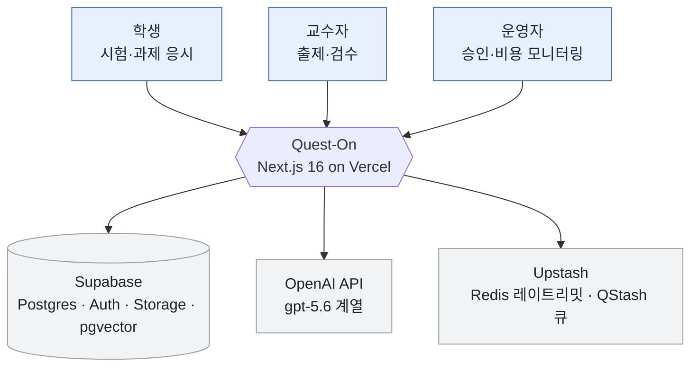

| 외부 시스템 | 쓰는 이유 | 없으면 |
|---|---|---|
| Supabase | DB, 인증, 파일 스토리지, pgvector 임베딩 | 아무것도 안 됨 |
| OpenAI | 문항 생성, 응시 중 튜터링, 객관식 자동 채점, 요약 | AI 기능 전부 정지, 응시 자체는 가능 |
| Upstash Redis | 서버리스 인스턴스 간 공유 레이트리밋 | 인메모리 폴백 — 인스턴스별로 따로 세므로 실효 없음 |
| Upstash QStash | 채점 잡 큐잉·재시도 | 프로덕션에서 채점 트리거가 `qstash_not_configured` 로 **소리 내며** 실패 (조용히 삼키지 않음) |

---

## L2 — 컨테이너

배포 단위와 그 사이의 통신. 한 그림에 다 넣으면 아무것도 안 보이므로 **동기 요청 경로**와 **비동기 작업 경로**를 나눈다.

### 동기 — 사용자 요청

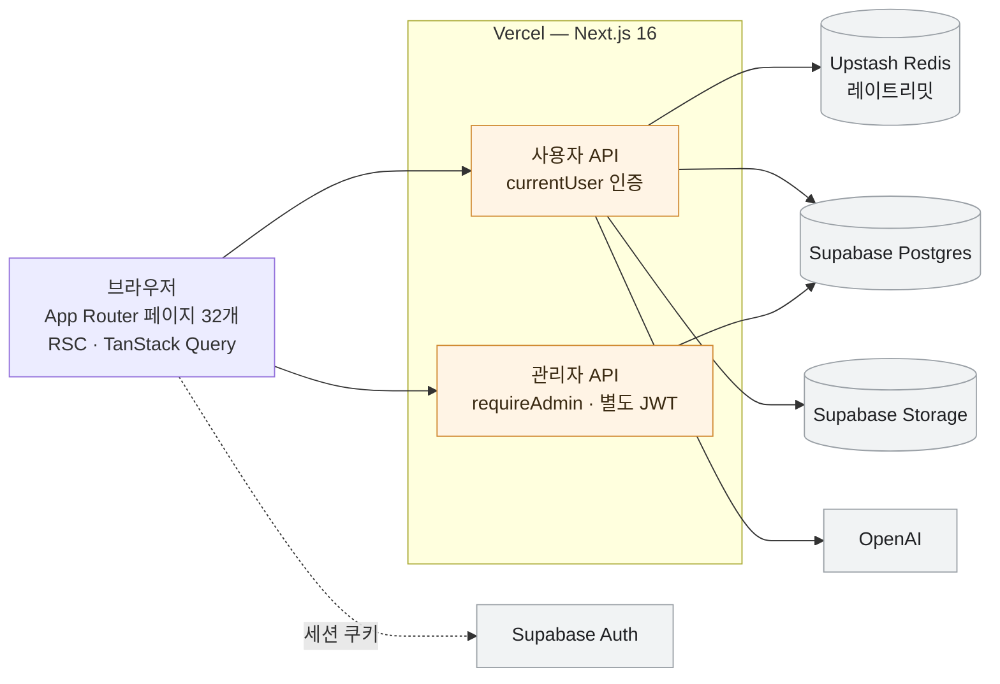

### 비동기 — 채점·RAG 작업

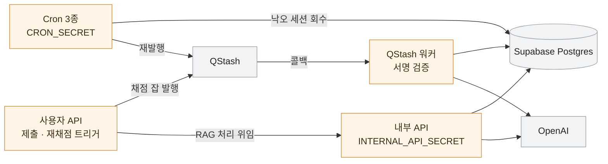

**핵심 규칙 — 컨테이너 경계에서 지켜야 하는 것**

- 런타임 DB 접근은 `getSupabaseServer()` (`lib/supabase-server.ts`) 하나뿐이다. 라우트에 raw SQL 을 넣지 않는다.
- **Prisma 는 런타임에 쓰지 않는다.** `prisma/schema.prisma` 는 introspection 결과이고 DDL 의 원천은 `database/[NNN]_*.sql` 이다. 런타임 `@prisma/client` import 는 0건이며 그 상태를 유지한다.
- `middleware.ts` 가 없다. **인증은 각 라우트 핸들러가 직접 한다.** 엣지에서 걸러진다고 가정하지 말 것.
- 워커·크론 라우트는 `currentUser()` 를 쓰지 않는다. QStash 서명 / `CRON_SECRET` / `INTERNAL_API_SECRET` 로 검증한다. 예외 목록은 `docs/SECURITY.md`.

---

## L3 — 컴포넌트

### 3-1. 인증과 역할 라우팅

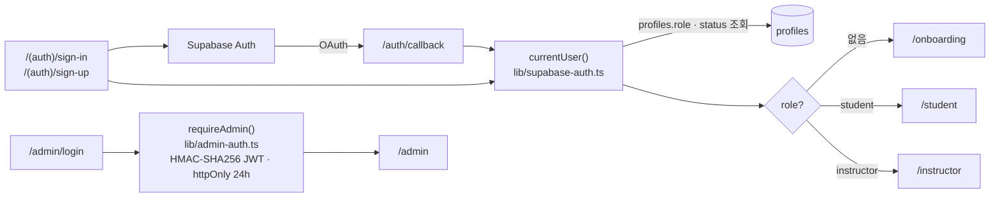

**권위는 `profiles.role` 이다.** 가입 시 `user_metadata.role` 에 힌트가 들어가지만 라우팅 판단은 하지 않는다 (`lib/onboarding-role.ts` 참고). 관리자 인증은 사용자 인증과 완전히 분리된 별도 계통이다.

`TEST_BYPASS_SECRET` 헤더 바이패스는 로컬(`development`)과 CI(`test`)에만 존재한다. 프로덕션·스테이징에서는 `lib/supabase-auth.ts` 가 요청 처리 중 throw 한다.

### 3-2. 응시 세션

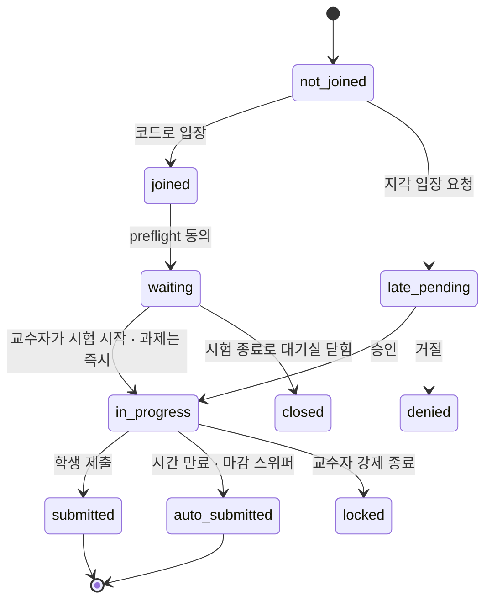

타이머 기준은 `attempt_timer_started_at` 이다. `started_at` 이 아니다. 지각 입장(`/api/exam/[examId]/late-entry`)은 원래 시험 시작 시각을 타이머 기준으로 넣어 남은 시간을 깎는다.

### 3-3. 채점 파이프라인

여기가 이 시스템에서 가장 깨지기 쉬운 부분이다. 손대기 전에 `docs/GRADING_PIPELINE_RUNBOOK.md` 를 읽는다.

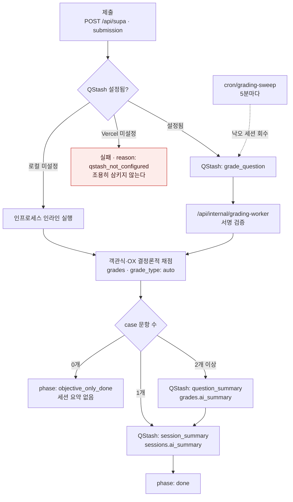

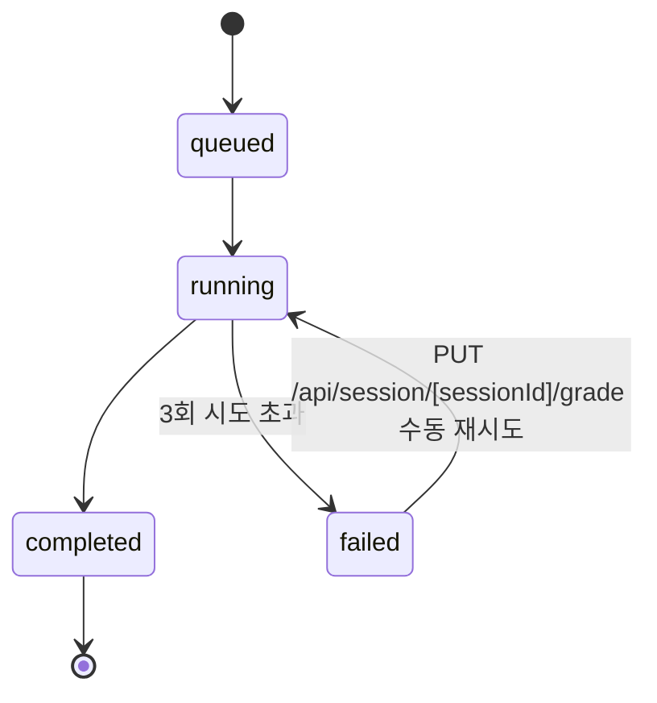

**에세이/케이스 점수는 제출 시 자동 채점되지 않는다.** 교수자가 `case-grade/chat` → `case-grade/commit` 으로 나중에 매긴다. commit 은 요약을 다시 생성하지 않는다.

스위퍼 안전장치: 세션당 60분 쿨다운(`last_swept_at`), 3회 시도 상한(`sweep_attempts`), 실행당 10세션 상한, `ai_summary` 가 이미 완성된 세션은 자동 해소. 비상 스위치는 `GRADING_SWEEP_DISABLED=1`.

QStash 중복 발행은 `gradingDedupId()` 의 `(session, phase, qIdx)` 결정론적 키가 막는다. 제출과 하트비트가 경합하거나 스위퍼가 아직 살아 있는 재시도와 겹쳐도 같은 잡이 두 번 돌지 않는다.

### 3-4. 자료 업로드 → RAG

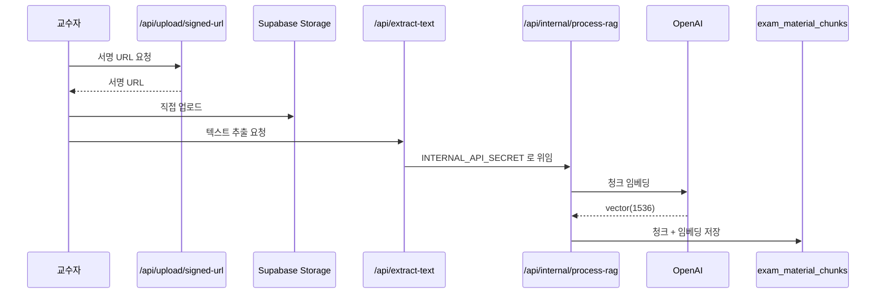

응시 중 `/api/chat` 은 `search-materials` 로 이 청크를 pgvector 검색해 컨텍스트로 넣는다.

### 3-5. 에이전트 런 (출제 보조)

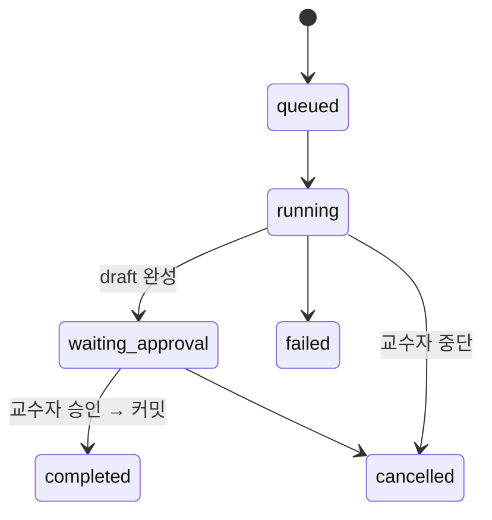

`cron/agent-sweeper` 가 10분마다 낙오된 런을 정리한다. 스텝 타입은 `user_input / plan / data_fetch / analysis / tool_call / draft / approval / final` (`lib/agent/types.ts`).

---

## 데이터 모델

`prisma/schema.prisma` 에 17개 모델이 있고, **`profiles` 는 거기 없지만 실제로 존재한다** — introspection 이 최신이 아니다. 역할 권위 테이블이므로 특히 주의한다.

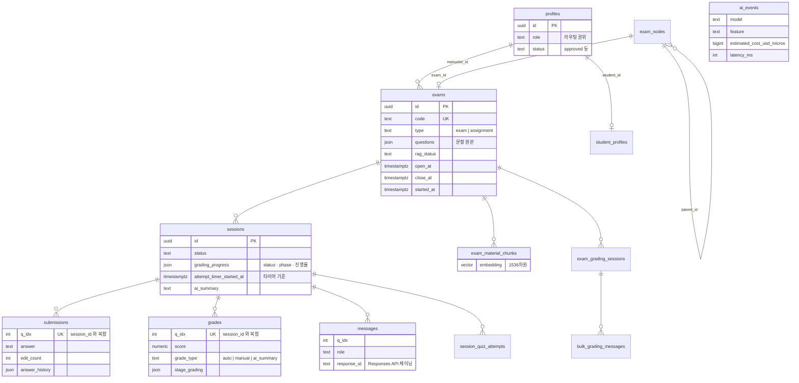

- `questions` 테이블은 **레거시**다. 문항 원본은 `exams.questions` JSON 이다.
- `exams.rubric` 컬럼은 남아 있지만 채점 파이프라인이 더 이상 읽지 않는다.
- `submissions` / `grades` 는 `(session_id, q_idx)` 로 유일하다. **qIdx 정합성이 채점 불변식의 핵심**이며 규칙은 아래 "거울 쌍 · 채점 불변식" 에 있다.
- 모든 AI 호출은 `lib/ai-tracking.ts` 를 거쳐 `ai_events` 에 토큰·지연·비용이 기록된다. 우회하면 관리자 대시보드가 비고 비용 추적이 끊긴다.

---

## 거울 쌍 · 채점 불변식

여기 있는 것은 **실제로 사고를 낸 적이 있는** 불변식이다. 손대기 전에 읽는다.

### 거울 쌍 (mirror pairs)

생성(new)·수정(edit) 폼은 거울이다. **복붙이라 import edge 가 없어 의존성 그래프로는 drift 를 못 잡는다.** 한쪽만 고치면 짝도 같이 고친다.

| 쌍 | 파일 |
|---|---|
| 시험 출제 | `app/(app)/instructor/new/page.tsx` ↔ `app/(app)/instructor/[examId]/edit/page.tsx` |
| 과제 출제 | `app/(app)/instructor/assignment/new/page.tsx` ↔ `app/(app)/instructor/assignment/[assignmentId]/edit/page.tsx` |

검증 로직은 양쪽이 `lib/authoring-validation.ts` 의 공용 헬퍼를 **import 해서** 쓴다. 한쪽에 복붙하면 `__tests__/mirror-drift.test.ts` 가 깨진다.

### 채점 불변식

- **qIdx 딥링크:** 딥링크·채점 선택은 배열 위치를 가정하지 않는다. 명시적 `qIdx` 또는 테스트된 `idx ?? pos` 규약을 쓴다. 회귀 가드는 `__tests__/qidx-grade-mapping.test.ts`.
- **객관식 채점:** MCQ/OX 는 raw 선택답 + `correctOptionIndex` 만 쓴다. AI grade row 나 `ai_summary` placeholder 를 섞지 않는다.
- **점수 비중:** 문항 유형 세트와 `score_weights` 는 항상 동기화한다. stale weight 금지.
- **시험/과제 공용 채점 게이트:** 양쪽에서 도달 가능한 채점 라우트·접근 가드는 `lib/grading-helpers.ts` 의 `isGradingOpen`/`isAssignmentType` 계약을 재사용한다. 공유 진입점에 `status==="closed"` 만 하드코딩하면 과제가 영구 차단된다.
- **과제 최종응답 데이터 소스:** 과제의 최종 자유응답은 `sessions.final_answer` 가 권위 데이터이고 학생-AI 대화는 `messages` 의 q_idx 0 이다. `submissions` 는 시험 답안과 과제 canvas·quiz 기록의 유효한 소스다.
- **단일 채점 writer:** 같은 `(session_id, q_idx)` grade 행을 `/api/session/[id]/grade` POST 와 `/api/session/[id]/case-grade/commit` 이 동시에 쓰지 않는다. 한 화면에 점수 확정 UI 를 둘 다 마운트하면 last-writer-wins clobber·stale 캐시가 된다.

---

## 라우트 지도

페이지 32개 / API 라우트 69개. 정확한 목록은 위의 `git ls-files` 명령으로 뽑는다.

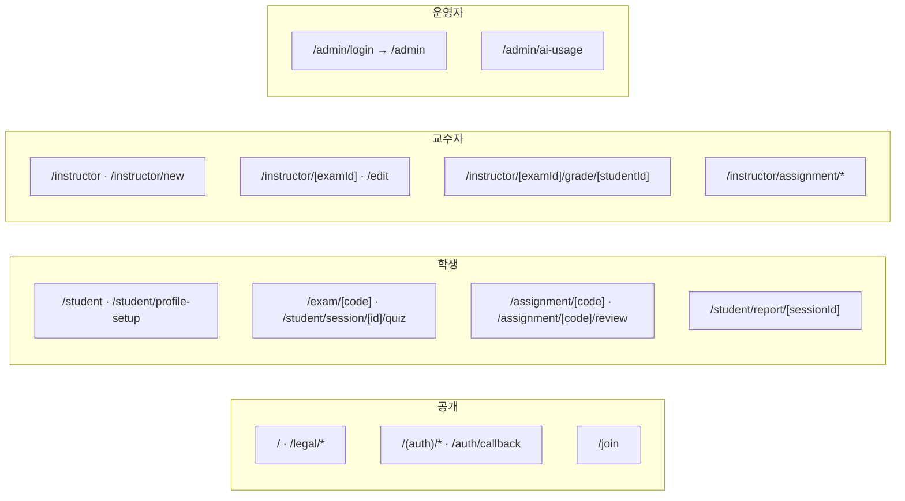

| API 그룹 | 접두사 | 인증 |
|---|---|---|
| 액션 멀티핸들러 | `/api/supa` | `currentUser()` |
| 시험 운영 | `/api/exam/[examId]/*` | `currentUser()` + 소유권 |
| 세션·응시 | `/api/session/*`, `/api/student/*` | `currentUser()` + 소유권 |
| AI 생성·대화 | `/api/ai/*`, `/api/chat`, `/api/feedback*`, `/api/assignment-chat` | `currentUser()` + 레이트리밋 |
| 에이전트 런 | `/api/agent/runs/*` | `currentUser()` |
| 관리자 | `/api/admin/*` | `requireAdmin()` |
| 내부 위임 | `/api/internal/*` | `INTERNAL_API_SECRET` |
| QStash 워커 | `/api/internal/grading-worker`, `/api/internal/bulk-grade-worker` | QStash 서명 |
| Cron | `/api/cron/*` | `CRON_SECRET` |

`/api/supa` 하나가 exam · drive · session · submission · assignment 핸들러를 모두 받는 멀티핸들러다. 이 파일이 커지는 것이 이 저장소의 구조적 부채다.

---

## 배포

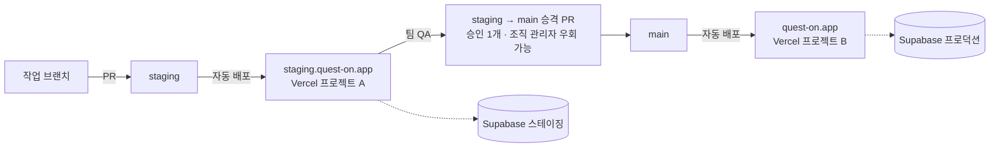

- 스테이징과 프로덕션은 **Supabase 프로젝트·Upstash·OpenAI 키를 공유하지 않는다.** 공유하면 QA 가 프로덕션 레이트리밋과 예산을 태운다.
- 스테이징 런타임은 프로덕션 크리덴셜을 절대 갖지 않는다. 스테이징이 뚫려도 프로덕션이 열리지 않아야 한다.
- `NEXT_PUBLIC_APP_ENV=staging` 이 없으면 스테이징이 자기를 프로덕션이라고 믿는다 (별도 Vercel 프로젝트도 `VERCEL_ENV=production` 이므로). 오타를 내면 `next.config.ts` 가 빌드를 깬다.
- 리전은 `iad1`, `icn1`. Cron 은 `grading-sweep` 5분, `agent-sweeper` 10분, `assignment-deadline-sweep` 5분.
- QStash 콜백 URL 우선순위: `QSTASH_WORKER_BASE_URL` > `NEXT_PUBLIC_APP_URL` > `VERCEL_URL`. 마지막은 배포마다 바뀌므로 경고를 남기며, 프로덕션에서 쓰면 안 된다.

상세는 `docs/STAGING.md`.

---

## 알려진 구조적 부채

여기 적는 것은 **지금 코드에서 확인되는 것만**이다. 고쳐지면 지운다. 일회성 감사 리포트를 여기에 쌓지 않는다.

| 항목 | 위치 | 왜 문제인가 |
|---|---|---|
| `middleware.ts` 부재 | 프로젝트 루트 | 인증이 라우트마다 반복된다. 하나 빠뜨리면 그대로 구멍 |
| CSP `unsafe-inline` | `next.config.ts` | Clerk 때문에 열어둔 것이었으나 Clerk 제거 후에도 남아 있다. XSS 표면 |
| CSRF 토큰 없음 | 상태 변경 라우트 전반 | SameSite 쿠키에만 의존 |
| `/api/supa` 멀티핸들러 비대화 | `app/api/supa/handlers/*` | 도메인 경계가 한 엔드포인트에 뭉쳐 있다 |
| `prisma/schema.prisma` 와 실제 스키마 불일치 | `profiles` 누락 | introspection 이 최신이 아님. 스키마를 근거로 판단하면 틀린다 |
| 레이트리밋 인메모리 폴백 | `lib/rate-limit.ts` | Redis 불가 시 인스턴스별로 따로 세므로 사실상 무제한 |
| `questions` 테이블 · `exams.rubric` 잔존 | DB | 읽는 코드가 없는데 남아 있어 오해를 만든다 |

보안 **규칙**(무엇을 지켜야 하는가)은 여기가 아니라 `docs/SECURITY.md` 에 있다. 이 문서는 구조만 다룬다.

---

## 더 볼 곳

| 주제 | 문서 |
|---|---|
| 에이전트 작업 규칙 (단일 계약) | `AGENTS.md` |
| 채점·QStash·스위퍼 운영 | `docs/GRADING_PIPELINE_RUNBOOK.md` |
| 인증·CORS·레이트리밋·입력검증 규칙 | `docs/SECURITY.md` |
| 스테이징 환경 구축·운영 | `docs/STAGING.md` |
| 테스트 명령과 기대치 | `docs/TESTING.md` |
| 라우트 핸들러 계약 | `app/api/CLAUDE.md` |
